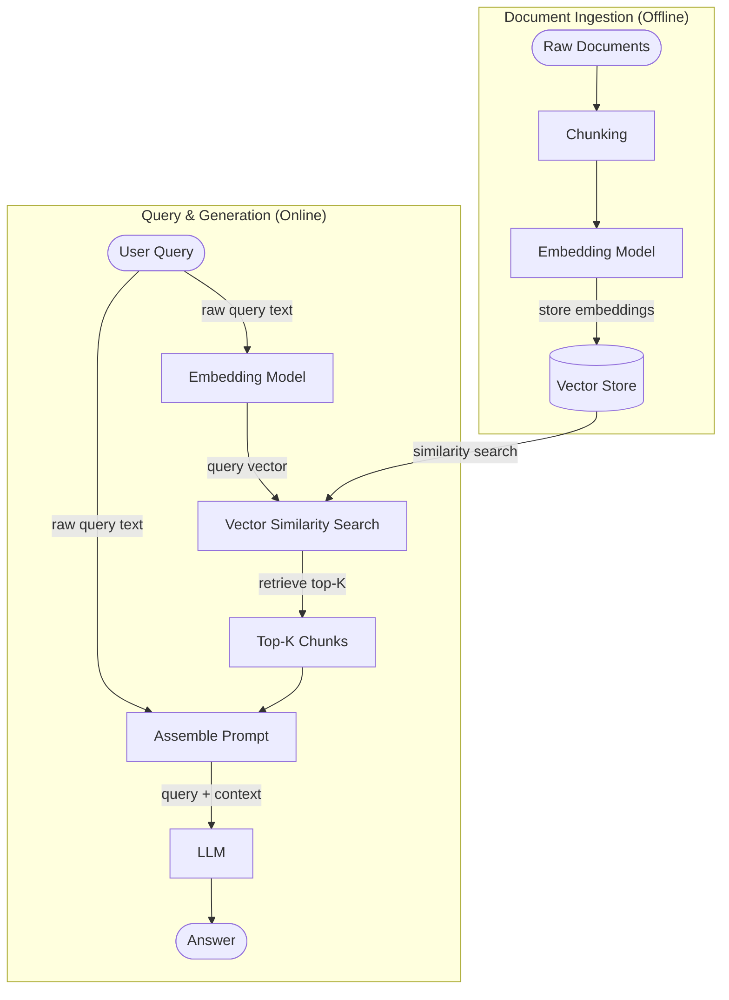

# RAG Flow

```mermaid
flowchart TD
    subgraph ingestion["Document Ingestion (Offline)"]
        rawDocs([Raw Documents])
        chunking[Chunking]
        embedModel[Embedding Model]
        vectorStore[(Vector Store)]

        rawDocs --> chunking
        chunking --> embedModel
        embedModel -->|"store embeddings"| vectorStore
    end

    subgraph online["Query & Generation (Online)"]
        userQuery([User Query])
        embedQuery[Embedding Model]
        simSearch[Vector Similarity Search]
        topK[Top-K Chunks]
        assemblePrompt[Assemble Prompt]
        llm[LLM]
        answer([Answer])

        userQuery -->|"raw query text"| embedQuery
        embedQuery -->|"query vector"| simSearch
        simSearch -->|"retrieve top-K"| topK
        topK --> assemblePrompt
        userQuery -->|"raw query text"| assemblePrompt
        assemblePrompt -->|"query + context"| llm
        llm --> answer
    end

    vectorStore -->|"similarity search"| simSearch
```
