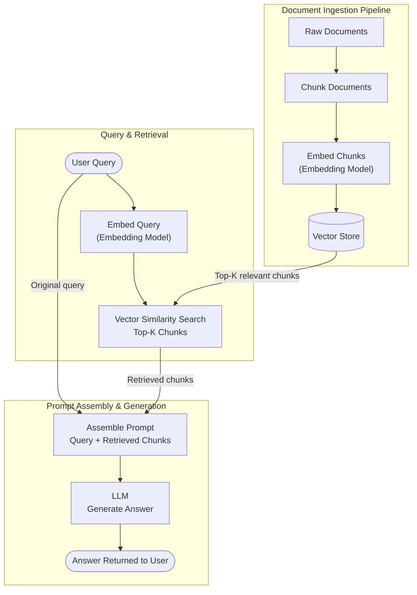

# RAG (Retrieval-Augmented Generation) Flow

```mermaid
flowchart TD
    subgraph ingestion["Document Ingestion Pipeline"]
        rawDocs["Raw Documents"]
        chunking["Chunk Documents"]
        embedDocs["Embed Chunks\n(Embedding Model)"]
        vectorStore[("Vector Store")]

        rawDocs --> chunking
        chunking --> embedDocs
        embedDocs --> vectorStore
    end

    subgraph retrieval["Query & Retrieval"]
        userQuery(["User Query"])
        embedQuery["Embed Query\n(Embedding Model)"]
        similaritySearch["Vector Similarity Search\nTop-K Chunks"]

        userQuery --> embedQuery
        embedQuery --> similaritySearch
    end

    subgraph generation["Prompt Assembly & Generation"]
        assemblePrompt["Assemble Prompt\nQuery + Retrieved Chunks"]
        llm["LLM\nGenerate Answer"]
        answer(["Answer Returned to User"])

        assemblePrompt --> llm
        llm --> answer
    end

    vectorStore -->|"Top-K relevant chunks"| similaritySearch
    similaritySearch -->|"Retrieved chunks"| assemblePrompt
    userQuery -->|"Original query"| assemblePrompt
```
